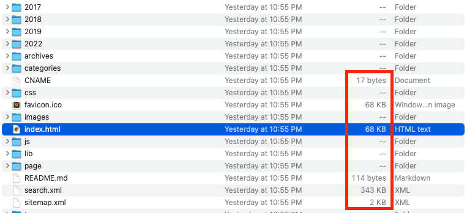
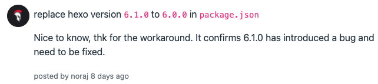

太久没更新博客了，最近准备拾起来。为了“改头换面”，今天想调整一下 sidebar 上的头像，因为是新电脑，没有 hexo 等环境，于是按照之前分享过的一篇[博文](https://www.yangbing.club/2019/06/29/save-hexo-source-post-with-git-branch/)，安装 hexo，替换 source 目录下的头像图片并调整 _config.xml，本地预览一切正常，然后直接执行 `hexo d`部署完成，访问网站域名 www.yangbing.club 发现直接404了，刷新了多次，用无痕浏览，等了许久再试，还是老样子，这可把我吓坏了，从未遇到过这等情况，等于博客直接挂了。

<!--more-->


# 排查和定位

## github 上的线索

发现 Actions 中此次 hexo deploy 触发的 build 和 deploy 均失败了。

build error 如下，[detail](https://github.com/sherlockyb/sherlockyb.github.io/runs/5642002288?check_suite_focus=true)

```shell
/usr/local/bundle/gems/jekyll-3.9.0/lib/jekyll/theme.rb:84:in `rescue in gemspec': The hexo-theme-next theme could not be found. (Jekyll::Errors::MissingDependencyException)
	from /usr/local/bundle/gems/jekyll-3.9.0/lib/jekyll/theme.rb:81:in `gemspec'
	from /usr/local/bundle/gems/jekyll-3.9.0/lib/jekyll/theme.rb:19:in `root'
	from /usr/local/bundle/gems/jekyll-3.9.0/lib/jekyll/theme.rb:12:in `initialize'
	from /usr/local/bundle/gems/jekyll-3.9.0/lib/jekyll/site.rb:439:in `new'
	from /usr/local/bundle/gems/jekyll-3.9.0/lib/jekyll/site.rb:439:in `configure_theme'
	from /usr/local/bundle/gems/jekyll-3.9.0/lib/jekyll/site.rb:55:in `config='
	from /usr/local/bundle/gems/jekyll-3.9.0/lib/jekyll/site.rb:23:in `initialize'
	from /usr/local/bundle/gems/jekyll-3.9.0/lib/jekyll/commands/build.rb:30:in `new'
	from /usr/local/bundle/gems/jekyll-3.9.0/lib/jekyll/commands/build.rb:30:in `process'
	from /usr/local/bundle/gems/github-pages-225/bin/github-pages:70:in `block (3 levels) in <top (required)>'
	from /usr/local/bundle/gems/mercenary-0.3.6/lib/mercenary/command.rb:220:in `block in execute'
	from /usr/local/bundle/gems/mercenary-0.3.6/lib/mercenary/command.rb:220:in `each'
	from /usr/local/bundle/gems/mercenary-0.3.6/lib/mercenary/command.rb:220:in `execute'
	from /usr/local/bundle/gems/mercenary-0.3.6/lib/mercenary/program.rb:42:in `go'
	from /usr/local/bundle/gems/mercenary-0.3.6/lib/mercenary.rb:19:in `program'
	from /usr/local/bundle/gems/github-pages-225/bin/github-pages:6:in `<top (required)>'
	from /usr/local/bundle/bin/github-pages:23:in `load'
	from /usr/local/bundle/bin/github-pages:23:in `<main>'
/usr/local/lib/ruby/2.7.0/rubygems/dependency.rb:311:in `to_specs': Could not find 'hexo-theme-next' (>= 0) among 158 total gem(s) (Gem::MissingSpecError)
Checked in 'GEM_PATH=/github/home/.gem/ruby/2.7.0:/usr/local/lib/ruby/gems/2.7.0:/usr/local/bundle', execute `gem env` for more information
	from /usr/local/lib/ruby/2.7.0/rubygems/dependency.rb:323:in `to_spec'
	from /usr/local/lib/ruby/2.7.0/rubygems/specification.rb:986:in `find_by_name'
	from /usr/local/bundle/gems/jekyll-3.9.0/lib/jekyll/theme.rb:82:in `gemspec'
	from /usr/local/bundle/gems/jekyll-3.9.0/lib/jekyll/theme.rb:19:in `root'
	from /usr/local/bundle/gems/jekyll-3.9.0/lib/jekyll/theme.rb:12:in `initialize'
	from /usr/local/bundle/gems/jekyll-3.9.0/lib/jekyll/site.rb:439:in `new'
	from /usr/local/bundle/gems/jekyll-3.9.0/lib/jekyll/site.rb:439:in `configure_theme'
	from /usr/local/bundle/gems/jekyll-3.9.0/lib/jekyll/site.rb:55:in `config='
	from /usr/local/bundle/gems/jekyll-3.9.0/lib/jekyll/site.rb:23:in `initialize'
	from /usr/local/bundle/gems/jekyll-3.9.0/lib/jekyll/commands/build.rb:30:in `new'
	from /usr/local/bundle/gems/jekyll-3.9.0/lib/jekyll/commands/build.rb:30:in `process'
	from /usr/local/bundle/gems/github-pages-225/bin/github-pages:70:in `block (3 levels) in <top (required)>'
	from /usr/local/bundle/gems/mercenary-0.3.6/lib/mercenary/command.rb:220:in `block in execute'
	from /usr/local/bundle/gems/mercenary-0.3.6/lib/mercenary/command.rb:220:in `each'
	from /usr/local/bundle/gems/mercenary-0.3.6/lib/mercenary/command.rb:220:in `execute'
	from /usr/local/bundle/gems/mercenary-0.3.6/lib/mercenary/program.rb:42:in `go'
	from /usr/local/bundle/gems/mercenary-0.3.6/lib/mercenary.rb:19:in `program'
	from /usr/local/bundle/gems/github-pages-225/bin/github-pages:6:in `<top (required)>'
	from /usr/local/bundle/bin/github-pages:23:in `load'
	from /usr/local/bundle/bin/github-pages:23:in `<main>'
  Logging at level: debug
Configuration file: /github/workspace/./_config.yml
             Theme: hexo-theme-next
github-pages 225 | Error:  The hexo-theme-next theme could not be found.
```

 deploy error 如下，[detail](https://github.com/sherlockyb/sherlockyb.github.io/runs/5642009024?check_suite_focus=true)

```
Actor: sherlockyb
Action ID: 2021541511
Artifact URL: https://pipelines.actions.githubusercontent.com/QrvX2bmakfCgkbXyG4yo3O1Y8LmS1Eviu5tBLZPSm6baFeu9Sw/_apis/pipelines/workflows/2021541511/artifacts?api-version=6.0-preview
{"count":0,"value":[]}
Failed to create deployment for 64e432b334b99462a8b0c082f955d6f5a99e6cde.
Error: Error: No uploaded artifact was found! Please check if there are any errors at build step.
Error: Error: No uploaded artifact was found! Please check if there are any errors at build step.
Sending telemetry for run id 2021541511
```

deploy 不用看，自然是 build 失败导致缺少需要的文件。从 build 错误日志中看到，

`Error:  The hexo-theme-next theme could not be found.`

这个没改过，我又确认了下 site 目录下的文件夹，hexo-theme-next 是存在的。于是我将其改为 next 试试，还是不行，感觉不是这个问题，此路不通。

## 可能是CNAME失效，导致域名跳转失败？

直接访问 https://sherlockyb.github.io 试试，发现并没有出现404，但首页空白，难道 hexo 生成的 index.html 是空的？通过 inspect 看了下首页源码，还真是空白页！除了 html, head 和 body 三对空标签，其他什么内容都没有。


然后也查看了下本地 `hexo generate` 产生的 public 文件夹，发现不仅 index.html，很多其他文件也都是 zero bytes，


于是问题变为 hexo 生成的HTML为空，继续 Google，发现有[网友](https://alanlee.fun/2021/02/28/hexo-empty-html/)也遇到过类似问题并解决了，原因是，

> hexo 与 node 的版本不兼容，要么 node 过高，要么 hexo 过低

我查了下本地安装的 hexo 版本，`./node_modules/hexo/bin/hexo --version`

```shell
hexo: 3.9.0
hexo-cli: 2.0.0
os: Darwin 20.6.0 darwin x64
node: 15.5.0
v8: 9.6.180.15-node.16
uv: 1.43.0
zlib: 1.2.11
brotli: 1.0.9
ares: 1.18.1
modules: 102
nghttp2: 1.47.0
napi: 8
llhttp: 6.0.4
openssl: 3.0.2+quic
cldr: 40.0
icu: 70.1
tz: 2021a3
unicode: 14.0
ngtcp2: 0.1.0-DEV
nghttp3: 0.1.0-DEV
```

hexo-3.9.0 是比较老的版本了，截止发稿最新版已经是 6.1.0 了，而 node 的版本却高达 15.5.0，是比较符合前面提到的 cause 的，剩下的问题就是如何升级 hexo 或者降级 node 了。

# 解决问题

## 降级 node

先看看如何降级 node。

先卸载再重装是可以的，且简单粗暴，但并不想这么做，因为已有很多其他项目的前端代码也依赖当前版本的 node，如果因为降级 node 版本而带来未知的影响得不偿失。网上又 Google 了一番，发现有 nvm 这个好东西，可以随时切换指定版本的 node，就它了。

### 安装 nvm

先是 `brew install nvm` ，但执行完后，尝试 nvm 命令时却提示 `command not found`，按照[文中](https://www.jianshu.com/p/23775773b9d3)网友说法，通过 brew 安装存在 bug，可用如下脚本安装，

```shell
curl -o- https://raw.githubusercontent.com/nvm-sh/nvm/v0.39.1/install.sh | bash
```

在 Mac 下如果遇到如下错误，

```shell
./install.sh: line 416: /Users/sherlockyb/.zshrc: Permission denied
```

直接进到 nvm 的默认的 git 目录 `~/.nvm`，然后执行 `sudo ./install.sh`，可以看到安装脚本会转而使用 `.bash_profile`文件，

```shell
Appending nvm source string to /Users/sherlockyb/.bash_profile
```

安装结束后，重新打开 terminal 查看 nvm 版本如下，表示安装成功。

```shell
sherlockyb@07L0220100005DD sherlockyb.github.io % nvm --version
0.39.1
```

### 用 nvm 降级 node 到 12.14.0

用法很简单，两行命令就搞定，

```shell
nvm install 12.14.0
nvm use 12.14.0
```

**这里需注意**，`nvm use` 只是临时切换 node 版本，只适用于当前 terminal，如果打开新的 terminal，node 还是之前的旧版本。如果想要永久切换的话，可使用如下命令，

```
nvm alias default 12.14.0
```

然后再查看 node 版本如下，已经降级了

```shell
sherlockyb@07L0220100005DD sherlockyb.github.io % node --version
v12.14.0
```

此时再通过 `./node_modules/hexo/bin/hexo --version` 查看 hexo 及其依赖包的版本时如下，node 版本已经变了。

```shell
hexo: 3.9.0
hexo-cli: 2.0.0
os: Darwin 20.6.0 darwin x64
node: 12.14.0
v8: 7.7.299.13-node.16
uv: 1.33.1
zlib: 1.2.11
brotli: 1.0.7
ares: 1.15.0
modules: 72
nghttp2: 1.39.2
napi: 5
llhttp: 1.1.4
http_parser: 2.8.0
openssl: 1.1.1d
cldr: 35.1
icu: 64.2
tz: 2019c
unicode: 12.1
```

### 重新生成HTML

清除并重新 generate，

```
./node_modules/hexo/bin/hexo clean
./node_modules/hexo/bin/hexo g
```

然后再查看 public 文件夹，会发现 index.html 已经正常生成了，打开后内容也是正常。最后本地预览一下，网站各项功能都没啥问题。



### 部署

最后通过 `./node_modules/hexo/bin/hexo d` 部署到GitHub Pages，网站恢复正常。

## 升级 hexo

降级 node 已经被验证是可行且简单的，不妨再尝试下升级 hexo 会咋样。

此次 hexo 是通过 `npm install hexo` 安装的，得到的默认版本就是 3.9.0，尝试升级 hexo 到最新版。

### 先执行 `npm i hexo-cli`

安装特别慢，这种一般是由于国内访问 npm 默认的外网官方源 `https://registry.npmjs.org/` 比较慢，于是将其切换为国内镜像，

```
npm config set registry http://r.cnpmjs.org/
```

再执行上述命令时，发现快很多。

此时再查看 hexo 版本，暂时还未变化。

### 再依次执行如下命令

```shell
npm install npm-check                     // 安装 npm-check 到当前 node_modules 目录
./node_modules/npm-check/bin/cli.js       // 查看系统插件是否需要升级
npm install npm-upgrade
./node_modules/npm-upgrade/lib/bin/cli.js // 更新 package.json
npm update --save                         // 更新插件
```

执行完 `npm update --save` 后，可以看到 hexo 版本升级到了 6.1.0，并且 hexo-deployer-git 等相关 hexo 插件也随之升级了。

```
+ hexo-generator-category@1.0.0
+ hexo-generator-archive@1.0.0
+ hexo-deployer-git@3.0.0
+ hexo-renderer-marked@5.0.0
+ hexo-generator-search@2.4.3
+ hexo-generator-index@2.0.0
+ hexo@6.1.0
+ hexo-generator-sitemap@3.0.1
+ hexo-renderer-ejs@2.0.0
+ hexo-generator-tag@1.0.0
+ hexo-renderer-stylus@2.0.1
+ hexo-server@3.0.0
added 93 packages from 104 contributors, removed 259 packages and updated 56 packages in 382.579s
```

### 问题层出不穷

就当我以为这就搞定了时，执行 `./node_modules/hexo-cli/bin/hexo --version` 时却报如下错误，

```shell
FATAL YAMLException: Specified list of YAML types (or a single Type object) contains a non-Type object.
    at /Users/biyang/DevCodes/sherlockyb.github.io/node_modules/hexo/node_modules/js-yaml/lib/schema.js:104:13
    at Array.forEach (<anonymous>)
    at Schema.extend (/Users/biyang/DevCodes/sherlockyb.github.io/node_modules/hexo/node_modules/js-yaml/lib/schema.js:102:12)
    at Object.<anonymous> (/Users/biyang/DevCodes/sherlockyb.github.io/node_modules/hexo/lib/plugins/renderer/yaml.js:5:36)
    at Module._compile (node:internal/modules/cjs/loader:1108:14)
    at Object.Module._extensions..js (node:internal/modules/cjs/loader:1137:10)
    at Module.load (node:internal/modules/cjs/loader:973:32)
    at Function.Module._load (node:internal/modules/cjs/loader:813:14)
    at Module.require (node:internal/modules/cjs/loader:997:19)
    at require (node:internal/modules/cjs/helpers:92:18)
    at module.exports (/Users/biyang/DevCodes/sherlockyb.github.io/node_modules/hexo/lib/plugins/renderer/index.js:15:16)
    at Hexo.init (/Users/biyang/DevCodes/sherlockyb.github.io/node_modules/hexo/lib/hexo/index.js:235:35)
    at /Users/biyang/DevCodes/sherlockyb.github.io/node_modules/hexo-cli/lib/hexo.js:49:17
    at tryCatcher (/Users/biyang/DevCodes/sherlockyb.github.io/node_modules/bluebird/js/release/util.js:16:23)
    at Promise._settlePromiseFromHandler (/Users/biyang/DevCodes/sherlockyb.github.io/node_modules/bluebird/js/release/promise.js:547:31)
    at Promise._settlePromise (/Users/biyang/DevCodes/sherlockyb.github.io/node_modules/bluebird/js/release/promise.js:604:18) {
  reason: 'Specified list of YAML types (or a single Type object) contains a non-Type object.',
  mark: undefined
}
```

#### hexo 6.1.0 的 bug

Google了一番发现，在这个 [issue](https://issuehunt.io/r/hexojs/hexo/issues/4917) 中找到了答案，貌似是 6.1.0 版本引入了 bug，解决方案是回退到 6.0.0，



于是通过 `npm i hexo@6.0.0` 回退，执行成功后，再次查看 hexo 版本，回复正常了。

```
hexo: 6.0.0
hexo-cli: 4.3.0
os: darwin 20.6.0 11.6
node: 15.5.0
v8: 8.6.395.17-node.23
uv: 1.40.0
zlib: 1.2.11
brotli: 1.0.9
ares: 1.17.1
modules: 88
nghttp2: 1.41.0
napi: 7
llhttp: 2.1.3
openssl: 1.1.1i
cldr: 37.0
icu: 67.1
tz: 2019c
unicode: 13.0
```

#### swig模板失效了

然后尝试重新生成 HTML，却发现index.html文件内容长这样，

```html




 {{ config.title }} 


   page-home 



  <section id="posts" class="posts-expand">
    
      {{ post_template.render(post, true) }}
    
  </section>

  



  {{ sidebar_template.render(false) }}

```

这是 `next/layout` 下 `index.swig` 中的原始内容，说明 swig 模板压根没被处理，因为我的 NexT 主题还比较老（5.1.0），用的是 swig，而从该 [issue](https://github.com/next-theme/hexo-theme-next/issues/4) 可得知，鉴于 swig 缺乏维护，**hexo 从 5.0 开始移除了对 swig 模板的支持，改为独立的 hexo-renderer-swig 插件**，对于 NexT 则是从 7.4.2 版本开始，使用 Nunjucks 代替 swig 作为新的模板引擎。也就是说想要继续使用 swig，需要单独安装 hexo-renderer-swig 插件。顺便看了下 swig 的[官网](https://www.swig.org/)，最新的 Release News 也是两年前了。

话不多说，执行 `npm install hexo-renderer-swig`，然后重新生成 HTML，看了下内容，这回终于正常了。

#### 若干小问题

通过 `./node_modules/hexo/bin/hexo s` 本地预览，网站整体功能是没问题，但又发现若干小问题，

* sidebar 的头像没有了，据说是 hexo 从 5.4.0 开始就去掉 avatar 的配置项了，交由主题去管理，好在 NexT 5.1.0 是有 avatar 这个配置项的，只不过之前没开启而已，这个还挺容易解决。
* 翻页的button 处，awesome icon 不展示，显示为源码了
* 查看单个博客上下滑动时，左侧目录栏不跟着一起变了

从前面降级 node 可以看出，之前 3.9.0 版本的 hexo 还是好的，看起来就是高版本的 hexo 6.0 与低版本的 NexT 5.1.0 有若干不兼容的地方。上面提到的只是通过简单验证发现的问题，可能还有其他未知的问题。当然，这些小问题都是可以通过改配置或者是改源码来修复。

#### 放弃回归 node 降级

考虑到时间成本，我就不继续下去了，放弃升级，回滚 hexo 至 3.9.0，最终采用降级 node 的方案。

# 划重点

* hexo 与 node 版本不兼容，可能导致生成的HTML为空，建议降级 node 更安全。
* hexo 5.0 之后不再内置支持 swig，若需要，得单独安装 hexo-renderer-swig。
* nvm 乃管理 node 版本的神器，推荐。

