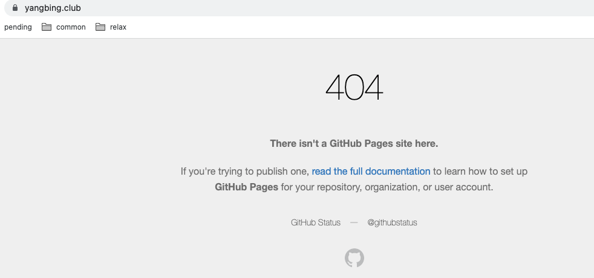
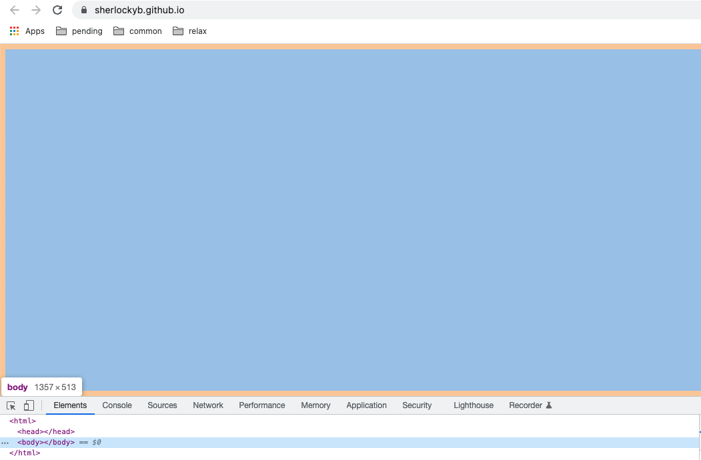
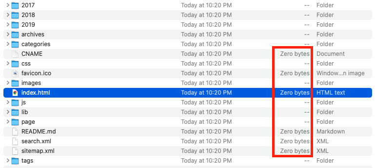

太久没更新博客了，最近准备拾起来。于是为了“改头换面”，今天想调整一下 sidebar 上的头像，因为是新电脑，没有 hexo 等环境，于是按照之前分享过的一篇[博文](https://www.yangbing.club/2019/06/29/save-hexo-source-post-with-git-branch/)，安装 hexo，替换 source 目录下的头像图片并调整 _config.xml，本地预览一切正常，然后直接执行 `hexo d`部署完成，访问网站域名 www.yangbing.club 发现直接404了，刷新了多次，用无痕浏览，等了许久再试，还是老样子，这可把我吓坏了，从未遇到过这等情况，等于博客直接挂了。

<!--more-->




# 排查和定位

## github上的线索

发现 Actions 中此次 hexo deploy 触发的 build 和 deploy 均失败了。

### build error如下，[detail](https://github.com/sherlockyb/sherlockyb.github.io/runs/5642002288?check_suite_focus=true)

```shell
/usr/local/bundle/gems/jekyll-3.9.0/lib/jekyll/theme.rb:84:in `rescue in gemspec': The hexo-theme-next theme could not be found. (Jekyll::Errors::MissingDependencyException)
	from /usr/local/bundle/gems/jekyll-3.9.0/lib/jekyll/theme.rb:81:in `gemspec'
	from /usr/local/bundle/gems/jekyll-3.9.0/lib/jekyll/theme.rb:19:in `root'
	from /usr/local/bundle/gems/jekyll-3.9.0/lib/jekyll/theme.rb:12:in `initialize'
	from /usr/local/bundle/gems/jekyll-3.9.0/lib/jekyll/site.rb:439:in `new'
	from /usr/local/bundle/gems/jekyll-3.9.0/lib/jekyll/site.rb:439:in `configure_theme'
	from /usr/local/bundle/gems/jekyll-3.9.0/lib/jekyll/site.rb:55:in `config='
	from /usr/local/bundle/gems/jekyll-3.9.0/lib/jekyll/site.rb:23:in `initialize'
	from /usr/local/bundle/gems/jekyll-3.9.0/lib/jekyll/commands/build.rb:30:in `new'
	from /usr/local/bundle/gems/jekyll-3.9.0/lib/jekyll/commands/build.rb:30:in `process'
	from /usr/local/bundle/gems/github-pages-225/bin/github-pages:70:in `block (3 levels) in <top (required)>'
	from /usr/local/bundle/gems/mercenary-0.3.6/lib/mercenary/command.rb:220:in `block in execute'
	from /usr/local/bundle/gems/mercenary-0.3.6/lib/mercenary/command.rb:220:in `each'
	from /usr/local/bundle/gems/mercenary-0.3.6/lib/mercenary/command.rb:220:in `execute'
	from /usr/local/bundle/gems/mercenary-0.3.6/lib/mercenary/program.rb:42:in `go'
	from /usr/local/bundle/gems/mercenary-0.3.6/lib/mercenary.rb:19:in `program'
	from /usr/local/bundle/gems/github-pages-225/bin/github-pages:6:in `<top (required)>'
	from /usr/local/bundle/bin/github-pages:23:in `load'
	from /usr/local/bundle/bin/github-pages:23:in `<main>'
/usr/local/lib/ruby/2.7.0/rubygems/dependency.rb:311:in `to_specs': Could not find 'hexo-theme-next' (>= 0) among 158 total gem(s) (Gem::MissingSpecError)
Checked in 'GEM_PATH=/github/home/.gem/ruby/2.7.0:/usr/local/lib/ruby/gems/2.7.0:/usr/local/bundle', execute `gem env` for more information
	from /usr/local/lib/ruby/2.7.0/rubygems/dependency.rb:323:in `to_spec'
	from /usr/local/lib/ruby/2.7.0/rubygems/specification.rb:986:in `find_by_name'
	from /usr/local/bundle/gems/jekyll-3.9.0/lib/jekyll/theme.rb:82:in `gemspec'
	from /usr/local/bundle/gems/jekyll-3.9.0/lib/jekyll/theme.rb:19:in `root'
	from /usr/local/bundle/gems/jekyll-3.9.0/lib/jekyll/theme.rb:12:in `initialize'
	from /usr/local/bundle/gems/jekyll-3.9.0/lib/jekyll/site.rb:439:in `new'
	from /usr/local/bundle/gems/jekyll-3.9.0/lib/jekyll/site.rb:439:in `configure_theme'
	from /usr/local/bundle/gems/jekyll-3.9.0/lib/jekyll/site.rb:55:in `config='
	from /usr/local/bundle/gems/jekyll-3.9.0/lib/jekyll/site.rb:23:in `initialize'
	from /usr/local/bundle/gems/jekyll-3.9.0/lib/jekyll/commands/build.rb:30:in `new'
	from /usr/local/bundle/gems/jekyll-3.9.0/lib/jekyll/commands/build.rb:30:in `process'
	from /usr/local/bundle/gems/github-pages-225/bin/github-pages:70:in `block (3 levels) in <top (required)>'
	from /usr/local/bundle/gems/mercenary-0.3.6/lib/mercenary/command.rb:220:in `block in execute'
	from /usr/local/bundle/gems/mercenary-0.3.6/lib/mercenary/command.rb:220:in `each'
	from /usr/local/bundle/gems/mercenary-0.3.6/lib/mercenary/command.rb:220:in `execute'
	from /usr/local/bundle/gems/mercenary-0.3.6/lib/mercenary/program.rb:42:in `go'
	from /usr/local/bundle/gems/mercenary-0.3.6/lib/mercenary.rb:19:in `program'
	from /usr/local/bundle/gems/github-pages-225/bin/github-pages:6:in `<top (required)>'
	from /usr/local/bundle/bin/github-pages:23:in `load'
	from /usr/local/bundle/bin/github-pages:23:in `<main>'
  Logging at level: debug
Configuration file: /github/workspace/./_config.yml
             Theme: hexo-theme-next
github-pages 225 | Error:  The hexo-theme-next theme could not be found.
```

### deploy error 如下，[detail](https://github.com/sherlockyb/sherlockyb.github.io/runs/5642009024?check_suite_focus=true)

```
Actor: sherlockyb
Action ID: 2021541511
Artifact URL: https://pipelines.actions.githubusercontent.com/QrvX2bmakfCgkbXyG4yo3O1Y8LmS1Eviu5tBLZPSm6baFeu9Sw/_apis/pipelines/workflows/2021541511/artifacts?api-version=6.0-preview
{"count":0,"value":[]}
Failed to create deployment for 64e432b334b99462a8b0c082f955d6f5a99e6cde.
Error: Error: No uploaded artifact was found! Please check if there are any errors at build step.
Error: Error: No uploaded artifact was found! Please check if there are any errors at build step.
Sending telemetry for run id 2021541511
```

deploy 不用看，自然是 build 失败导致缺少需要的文件。从 build 错误日志中看到，

`Error:  The hexo-theme-next theme could not be found.`

这个没改过，我又确认了下 site 目录下的文件夹，hexo-theme-next 是存在的。于是我将其改为 next 试试，还是不行，感觉不是这个问题，此路不通。

## 可能是CNAME失效，导致域名跳转失败？

直接访问 https://sherlockyb.github.io 试试，发现并没有出现404，但首页空白，难道 hexo 生成的 index.html 是空的？通过 inspect 看了下首页源码，还真是空白页！除了 html, head 和 body 三对标签，什么内容都没有。



然后也查看了下本地 `hexo generate` 产生的 public 文件夹，发现不仅 index.html，很多其他文件也都是 zero bytes，



于是继续 Google，发现有[网友](#参考)也遇到过类似问题并解决了，原因是，

> hexo 与 node 的版本不兼容，要么 node 过高，要么 hexo 过低

我查了下本地安装的 hexo 版本，

```
hexo: 3.9.0
hexo-cli: 2.0.0
os: Darwin 20.6.0 darwin x64
node: 17.8.0
v8: 9.6.180.15-node.16
uv: 1.43.0
zlib: 1.2.11
brotli: 1.0.9
ares: 1.18.1
modules: 102
nghttp2: 1.47.0
napi: 8
llhttp: 6.0.4
openssl: 3.0.2+quic
cldr: 40.0
icu: 70.1
tz: 2021a3
unicode: 14.0
ngtcp2: 0.1.0-DEV
nghttp3: 0.1.0-DEV
```

hexo-3.9.0 是比较老的版本了，截止发稿最新版已经是 6.1.0 了，而 node 的版本却高达 17.8.0，是比较符合前面提到的 cause 的，剩下的问题就是如何升级 hexo 或者 降级 node 了。

# 解决问题


# 参考：

1. [hexo 生成的 html 文件为空的问题](https://alanlee.fun/2021/02/28/hexo-empty-html/)


