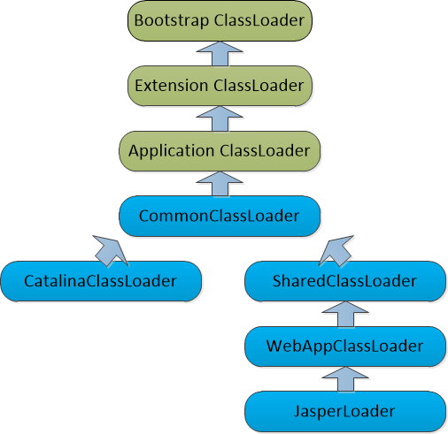
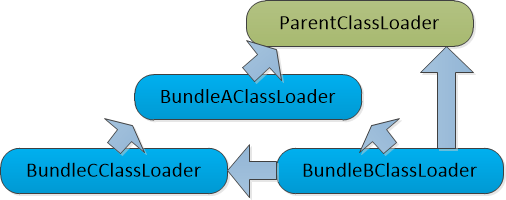

上一篇博文[Java类的生命周期](http://www.yangbing.club/2018/04/15/talk-about-java-class-lifecycle/)概要性地介绍了一个类从“出生”到“凋亡”的各个生命阶段。今天，笔者就跟大家聊聊其中非常重要的一个环节：类的加载过程。Java虚拟机中类加载的过程具体包含**加载**、**验证**、**准备**、**解析**和**初始化**这5个阶段，各阶段涉及的细节较多，在上一篇博文中都有简短介绍，本文将主要介绍加载阶段，其中包括加载方式、加载时机、类加载器原理、实例分析等内容。

<!--more-->

## 前言

在具体介绍类加载机制之前，我们先来看下网上关于理解类加载机制的经典题目：

```java
public class Singleton {
    private static Singleton singleton = new Singleton();
    public static int counter1;
    public static int counter2 = 0;
    
    private Singleton() {
        counter1++;
        counter2++;
    }
    
    public static Singleton getSingleton() {
        return singleton;
    }
}
// 打印静态属性的值
public class TestSingleton{
    public static void main(String[] args) {
        Singleton singleton = Singleton.getSingleton();
        System.out.println("counter1=" + singleton.counter1);
        System.out.println("counter2=" + singleton.counter2);
    }
}
// 输出结果：
>>> counter1=1
>>> counter2=0
```

关于为什么`counter2=0`，这里就不具体解释了，只是想说下它考核了那几个点：

> 1. 类加载过程的5个阶段先后顺序：准备阶段在初始化之前
> 2. 准备阶段和初始化阶段各自做的事情
> 3. 静态初始化的细节：先后顺序

## 什么是类的加载

言归正传，我们先从类加载的定义说起，一句话概述，

> 虚拟机将class文件中的二进制数据流加载到JVM运行时数据区的方法区内，并进行**验证**、**准备**、**解析**和**初始化**等动作后，在内存中创建**java.lang.class**对象，作为对方法区中该类数据结构的访问入口。

这里有几点要解释下，class文件是指符合**class文件格式**的二进制数据流，也就是我们常说的字节码文件，它是我们与JVM约定的格式协议，只要是符合**class文件格式**的二进制流，都可被JVM加载，这也是JVM跨平台的基础；另外，**java.lang.class**对象只是说在内存创建，并没有明确规定是否在Java堆中，对于Hotspot虚拟机，是存放在方法区的。

## 加载方式

类的加载方式分为两种：隐式加载和显式加载。

### 隐式加载

实际就是不用我们代码主动声明，而是JVM在适当的时机自动加载类。比如主动引用某个类时，会自动触发类加载和初始化阶段。

### 显式加载

则通常是指通过代码的方式显式加载指定类，常见以下几种：

> 通过`Class.forName()`加载指定类。对于`forName(String className)`方法，默认会执行静态初始化，但如果使用另一个重载函数`forName(String name, boolean initialize, ClassLoader loader)`，实际上是可以通过`initialize`来控制是否执行静态初始化
>
> 通过`ClassLoader.loadClass()`加载指定类，这种方式仅仅是将.class加载到JVM，并不会执行静态初始化块，这个等后面谈到类加载器的职责时会再强调这一点

关于`Class.forName()`是否执行静态初始化，通过源码就能一目了然：

```java
public static Class<?> forName(String className)	// 执行初始化，因为initialize为true
            throws ClassNotFoundException {
    Class<?> caller = Reflection.getCallerClass();
    return forName0(className, true, ClassLoader.getClassLoader(caller), caller);
}
...
public static Class<?> forName(String name, boolean initialize,
                               ClassLoader loader)  // 可控的，通过initialize来指定初始化与否
    throws ClassNotFoundException
{
    ...
    return forName0(name, initialize, loader, caller);
}
```

## 加载时机

类加载的第一个阶段——加载阶段具体什么时候开始，虚拟机规范并未指明，由具体的虚拟机实现决定，可分为预加载和运行时加载两种时机：

1. 预加载：对于JDK中的常用基础库——`JAVA_HOME/lib`下的**rt.jar**，它包含了我们最常用的class，如`java.lang.*`、`java.util.*`等，在虚拟机启动时会提前加载，这样用到时就省去了加载耗时，能加快访问速度。
2. 运行时加载：大多数类比如用户代码，都是在类第一次被使用时才加载的，也就是常说的惰性加载，这么做的比较直观的原因大概是节省内存吧。

## 加载原理

### loadClass源码

先上代码（JDK1.7源码）：

```java
protected Class<?> loadClass(String name, boolean resolve)
        throws ClassNotFoundException
    {
        synchronized (getClassLoadingLock(name)) {
            // First, check if the class has already been loaded
            Class c = findLoadedClass(name);
            if (c == null) {
                long t0 = System.nanoTime();
                try {
                    if (parent != null) {
                        c = parent.loadClass(name, false);
                    } else {
                        c = findBootstrapClassOrNull(name);
                    }
                } catch (ClassNotFoundException e) {
                    // ClassNotFoundException thrown if class not found
                    // from the non-null parent class loader
                }

                if (c == null) {
                    // If still not found, then invoke findClass in order
                    // to find the class.
                    long t1 = System.nanoTime();
                    c = findClass(name);

                    // this is the defining class loader; record the stats
                    sun.misc.PerfCounter.getParentDelegationTime().addTime(t1 - t0);
                    sun.misc.PerfCounter.getFindClassTime().addElapsedTimeFrom(t1);
                    sun.misc.PerfCounter.getFindClasses().increment();
                }
            }
            if (resolve) {
                resolveClass(c);
            }
            return c;
        }
    }
```

`loadClass`是类加载机制中最核心的代码，这段代码基本阐述了以下最核心的两点：

#### 缓存机制

`findLoadedClass(name)`，首先第一步就检查这个`name`表示的类是否已被某个类加载器实例加载过，若已加载，则直接返回已加载的`c`，否则才继续下面的委派等逻辑。即JVM层会对已加载的类进行缓存，那具体是怎么缓存的的呢？在JVM实现中，有个类似于`HashTable`的数据结构叫做**SystemDictionary**，对已加载的类信息进行缓存，缓存的`key`是类加载器实例+类的全限定名，`value`则是指向表示类信息的**klass**数据结构。这也是为什么我们常说，JVM中加载类的类加载器实例加上类的全限定名，这两者一起才能唯一确定一个类。每个类加载器实例就相当于是一个独立的类命名空间，对于两个不同类加载器实例加载的类，即便名称相同，也是两个完全不同的类。

#### 双亲委派

对于新加载的类，缓存没命中后走双亲委派逻辑——当`parent`存在时，会先委派给`parent`进行`loadClass`，然后`parent.loadClass`内部又会进行同样的向上委派，直至`parent`为`null`，委派给根加载器。也就是说委派请求会一直向上传递，直到顶层的引导类加载器，然后再统一用**ClassNotFoundException**异常的方式逐层向下回传，直到某一层`classLoader`在其搜索范围内找到并加载该类；当`parent`不存在时，即没有父类加载器，此时直接委派给顶层加载器——`BootstrapClassLoader`。

从这里可以看到双亲委派结构中，类加载器之间的父子层级关系**并不是通过继承来实现**，而是通过组合的方式即子类加载器持有`parent`代理以指向父类加载器来实现的。

#### 要点

1. **由于委派是单向的**，处于子类加载器层级的类，可以访问父类加载器层级的类，反过来不行
2. **各执其责**，各层级的类加载器只负责加载本层级下的类。实现方式：各层级类加载器有自己的加载路径，路径隔离，互不可见。**URLClassLoader**的`ucp`属性了解下~
3. **ClassNotFoundException**——父子类加载器之间的协议。只有当父类加载器抛出此异常时，加载请求才会向下层传递，其他异常不认！
4. 上下层的这种优先级进一步**保证了Java程序的稳定性**，对于JDK库中核心的类不会因为用户误定义的同名类而导致被覆盖。

## 类加载器

还是给个定义吧：

> 通过一个类的全限定名来获取描述此类的二进制字节流的代码模块

经典的三层加载器结构：


1、**启动类加载器**（或称为引导类加载器）：只负责加载`<JAVA_HOME>/lib`目录中的，或是启动参数`-Xbootclasspath`所指定路径中的**特定名称类库**。该加载器由C++实现，对Java程序不可见，对于自定义加载器，若是未指定parent，则会委派该加载器进行加载。

2、**扩展类加载器**：负责加载`<JAVA_HOME>/lib/ext`目录中的，或是`java.ext.dirs`系统变量所指定的路径下**所有类库**。该加载器由`sum.misc.Launcher$ExtClassLoader`实现，可直接使用。

3、**应用程序类加载器**（或称为系统类加载器）：负责加载用户类路径`ClassPath`中所有类库。该加载器由`sum.misc.Launcher$AppClassLoader`实现，可由`ClassLoader.getSystemClassLoader()`方法获得。

### 要点

`ExtClassLoader`和`AppClassLoader`都是继承自`URLClassLoader`，各自负责的加载路径都是保存在`ucp`属性中，这个看源码就能得知。

## 三次“破坏”

双亲委派并不是一个强制性约束模型，毕竟它自身也有局限性。无论是历史代码层面、SPI设计问题、还是新的热部署需求，都不可避免地会违背该原则，累计有三次“破坏”。

### 可覆盖的loadClass方法

通过ClassLoader的源码可知，双亲委派的实现细节都在loadClass方法中，而该方法是一个**protected**的，意味着子类可以覆盖该方法，从而可绕过双亲委派逻辑。双亲委派模型是在JDK1.2之后才被引入，在此之前的JDK1.0，已有部分用户通过继承ClassLoader重写了loadClass逻辑，这使得后面引入的双亲委派逻辑在这些用户程序中不起作用。

为了向前兼容，ClassLoader新增了findClass方法，提倡用户将自己的类加载逻辑放入findClass中，而不要再去覆盖loadClass方法。

### 自身缺陷，无法支持SPI

双亲委派的层次优先级就决定了用户代码和JDK基础类之间的不对等性，即只能用户代码调用基础类，反之不行。对于SPI之类的设计，比如已经成为Java标准服务的JNDI，其接口代码是在基础类中，而具体的实现代码则是在用户Classpath下，在双亲委派的限制下，JNDI无法调用实现层代码。

开个后门——引入**线程上下文类加载器**（Thread Context ClassLoader），该加载器可通过`java.lang.Thread.setContextClassLoader()`进行设置，若创建线程时未设置，则从父线程继承；若应用程序的全局范围都未设置过，则默认设置为应用程序类加载器，这个可在**Launcher**的源码中找到答案。

有了这个，JNDI服务就可使用该加载器去加载所需的SPI代码。其他类似的SPI设计也是这种方式，如JDBC、JCE、JAXB、JBI等。

### 程序动态性的需求，即热部署

模块化热部署，在生产环境中显得尤为有吸引力，就像我们的计算机外设一样，不用重启，可随时更换鼠标、U盘等。
OSGi已经成为业界事实上的Java模块化标准，此时类加载器不再是双亲委派中的树状层次，而是复杂的网状结构。

## 类加载器实例分析

### Tomcat——双亲委派的最佳实践者

通常Web服务器需要解决几个基本问题：

1. 同一个服务器上，部署两个及以上的Web应用程序，各自使用的Java类库可以相互隔离。
2. 多个Web应用程序，共享所使用的部分Java类库。比如都用到了同样版本的spring，共享一份，无论是本地磁盘，还是Web服务器内存（主要是方法区），都是不错的节省。
3. 保证服务器自身安全不受部署的Web应用程序影响，这跟前面谈到的双亲委派保证Java程序稳定性是一个道理。
4. 支持JSP的话，需要支持HotSwap功能。

为了应对以上基本问题，主流的Java Web服务器都会提供多个Classpath存放类库。对于Tomcat，其目录结构划分为以下4组：

1. `/common`目录，存放的类库被Tomcat和所有的Web应用程序共享。
2. `/server`目录，仅被Tomcat使用，其他Web应用程序不可见。
3. `/shared`目录，可被所有Web应用程序共享，但对Tomcat不可见。
4. `/WebApp/WEB-INF`目录，仅被所属的Web应用程序使用，对Tomcat和其他Web应用程序不可见。

跟以上目录对应的，是Tomcat经典的双亲委派类加载器架构：



上图中，CommonClassLoader、CatalinaClassLoader、SharedClassLoader和WebAppClassLoader分别负责`/common/*`、`/server/*`、`/shared/*`和`/WebApp/WEB-INF/*`目录下的Java类库加载，其中WebApp类加载器和Jsp类加载器通常会存在多个实例，每一个Web应用程序对应一个WebAppClassLoader，每一个JSP文件对应一个Jsp类加载器。

### OSGi——敢于突破

OSGi（Open Service Gateway Initiative）是OSGi联盟制定的一个基于Java语言的动态模块化规范，其最著名的应用案例就是Eclipse IDE，它是Eclipse强大插件体系的基础。

OSGi中的每个模块称为Bundle，一个Bundle可以声明它所依赖的Java Package（通过Import-Package描述），也可以声明它允许导出发布的Java Package（通过Export-Package描述）。Bundle之间的依赖关系为平级依赖，Bundle类加载器之间只有规则，没有固定的委派关系。假设存在BundleA、BundleB和BundleC，

> BundleA：声明发布了packageA，依赖了java.*的包
>
> BundleB：声明依赖了packageA和packageC，同时也依赖了java.*的包
>
> BundleC：声明发布了packageC，依赖了packageA

一个简单的OSGi类加载器架构示例如下：



上图的这种网状架构带来了更好的灵活性，但同时也可能产生许多新的隐患。比如Bundle之间的循环依赖，在高并发场景下导致加载死锁。

## 总结

本文以一个关于类加载的编程题为切入点，阐述了类加载阶段的具体细节，包括加载方式、加载时机、加载原理，以及双亲委派的优劣点。并以具体的类加载器实例Tomcat和OSGi为例，简单分析了类加载器在实践过程中的多种选择。