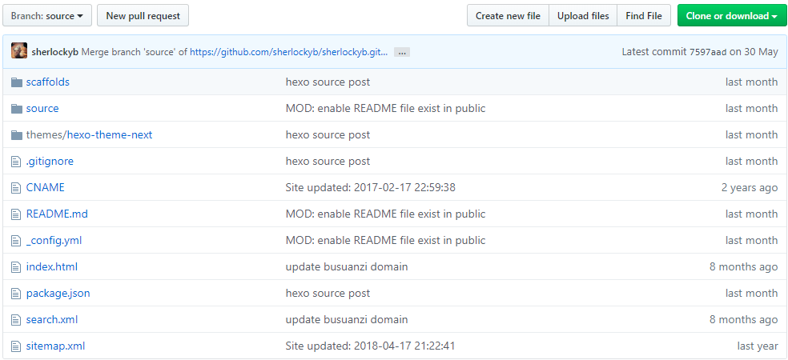

hexo是当前最火的静态博客框架，支持Markdown格式文章编辑并自动生成对应的静态网页，简单高效令人爱不释手。
使用hexo写博客的流程通常是，

1. 通过`hexo new post_name`命令，会自动在`source/_post`目录下生成一个待写的`post_name.md`文件
2. 编写完该md文件后，用`hexo generate`编译生成对应的HTML文件
3. 发布之前，可以用`hexo s`本地预览，然后通过`hexo deploy`发布到远程仓库的**master**分支，然后你的个人站点就能看到刚才新加的文章了

<!--more-->

### 困扰

然而，使用过hexo搭建个人博客的朋友们想必都会遇到博客源码保存的问题。即远程仓库只会保存hexo发布后的静态HTML文件，你的博客md源文件、主题配置等还在本地，一旦电脑磁盘坏了或者换了电脑，就无法在之前仓库的基础上继续写博客。针对此问题，有不少博主会在github上单独另起一个**repository**来专门保存博客源文件，每次发布完新文章，需要手动地将`source/post`下的md文件上传到源文件对应的**repository**，确实也能解决问题，但总归是麻烦。后来偶然看到聪明的网友借助git分支来巧妙地实现用同一个仓库保存静态网页和博客源码，自己试了下确实很赞，故总结之。

### 解决办法

#### 新建git分支

因Github Page要求使用master分支作为发布网站的源代码，我们只能用master分支来保存hexo生成的静态网页，对于博客源码，可以新建一个source分支来存储。在github上打开Pages对应的仓库，也就是以"username.github.io"命名的仓库，然后建立一个source分支，如下图：


因为我已经创建过source分支，故下方会显示目前该仓库上有master和source两个分支。其中source分支显示打钩，表示当前仓库的默认分支已经是source而不是master了，下面会讲。

#### 更改仓库的默认分支

github上的仓库初始都会有个master分支，也就是默认分支。对于一个仓库`project_name`，当我们通过`git clone https://github.com/sherlockyb/project_name.git`下载代码时，实际拉取的是默认分支master对应的代码。而我们用hexo写博客时，通常是与md源文件打交道，对于deploy生成的master分支代码并不需要我们关注，因此可将仓库的默认分支改为保存源码的source分支，这样通过`git clone`拉取的就是source分支代码了。

在仓库的主页面，通过Settings -> Branchs，可以看到**Default branch**的Tab，显示的默认分支是master，可以勾选source，然后update即可将默认分支设置为source，如下图：


#### 将本地hexo目录与远程仓库关联

进入到本地hexo工程目录，也就是我们通常执行`hexo new post`等命令的目录，执行如下操作：

```shell
git remote add origin https://github.com/sherlockyb/sherlockyb.github.io.git
```

#### 推送博客源码

将本地的md源文件、站点配置文件等推送到source分支。
因为我们只需要保留博客源码，其他无关的文件并不希望推送，需要确保配好了`.gitignore`文件，通常如下：

```shell
.DS_Store
Thumbs.db
db.json
*.log
node_modules/
public/
.deploy*/
```

然后依次执行如下命令：

```shell
git add .
git commit -m 'hexo source post'
git push origin source
```

#### 删除public等文件（可选）

因为source分支是从master分支新建的，初始代码实际就是master的拷贝，因而master中已有的public等deploy生成的文件也会一起带过来，这些都不算是博客源文件，如果你也觉着source分支还存着这些有些别扭，就可以先在本地把它删掉，然后执行：

```shell
git add .
git commit -m 'DEL: public things which only for deploy'
git push origin source
```

执行完之后，你的仓库大概就是长这个样子：



后续即便你再发布博客时，deploy生成public文件，在提交博客源码时，也不会将其带上去，因为有`.gitignore`将其忽略了。

### 新环境

假设我们换电脑了，要在新环境继续在原有仓库基础上撸文章，此时通过`git clone`将博客源码拉到本地，然后安装、初始化hexo就能搞定：

```shell
git clone https://github.com/sherlockyb/sherlockyb.github.io.git sherlockyb
cd sherlockyb
npm install hexo
npm install hexo-deployer-git -save

// hexo环境配置好后，继续像之前一样
hexo new post_name
...
```

### 注意事项

确保`hexo deploy`推送的是master分支，hexo目录下的_config.yml文件通常会配置deploy推送的目标地址，这个一般在最初使用hexo时，就会配置为master，不用改动：

```yaml
# Deployment
## Docs: https://hexo.io/docs/deployment.html
deploy:
  type: git
  repo: https://github.com/sherlockyb/sherlockyb.github.io.git
  branch: master
```


