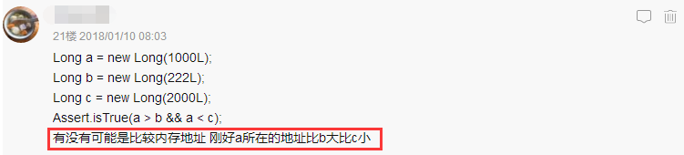

　　当我在Google输入“Long类型的比较”时，会出现多如牛毛的与这个问题相关的博文，并且这些博文对此问题的看法如出一辙，都“不约而同”地持有如下观点：
> 对于Long类型的数据，它是一个对象，所以对象不可以直接通过“>”，“==”，“<”的比较。若要比较是否相等，可以用Long对象的**equals**方法；若要进行“>”，“<”的比较，需通过Long对象的**longValue**方法。

那么问题来了，这个观点真的全对吗？或者准确地说，后半段关于“>”，“<”的说法真的对吗？起初我也差点信了，按理说Java中并没有像C++中的操作符重载之类的东东，对象直接拿来用“>”或“<”比较确实很少这么干的，而且有童鞋可能会说，既然大家都这么说，当然是对的无疑咯。那么今天笔者想告诉你的是，**它是错的**！**Long类型可以直接用“>”和“<”比较，并且其他包装类型也同理**。不信？先别急着反驳，且听笔者娓娓道来。

<!--more-->

# 问题起源

　　关于Long类型的大小比较这个问题，其实是源于我的上一篇博文[谈谈ali与Google的Java开发规范](http://www.yangbing.club/2017/12/30/talk-about-ali-and-google-s-java-developing-guideline/)，在其中关于“**相同类型的包装类对象之间值的比较**”这一规范，我补充了如下一点：
　　

　　然后oschina上的一个热心网友关于此提出了一个很好的问题：
　　


　　即有没有可能比较的是内存地址并且刚好其大小满足上述条件？想想也不无道理，毕竟对于Java中的对象引用a、b、c的值实际就是对象在堆中的地址。关于这个问题，其实我最初也质疑过，为此我编写了多种类似上面的testCase，比如：

```java
Long a = new Long(1000L);
Long b = new Long(2000L);
Long c = new Long(222L);
Assert.isTrue(a<b && a>c);	//断言成功
```

　　最终的结论跟预期一致的：两者的比较结果跟Long对象中的数值大小的比较结果是一致的，至少从目前所尝试过的所有testCase来看是这样的。

# 从现象到本质

　　但是，光靠那几个有限的单元测试，貌似并不具有较强的说服力，心中难免总有疑惑：会不会有特殊的case没覆盖到？会不会还是地址比较的巧合？怎么才能有效地验证我的结论呢？

　　于是我开始琢磨：毕竟对于`new Long()`这种操作，是在堆中动态分配内存的，我们不太好控制a、b等的地址大小，那又该怎么验证上述的比较不是地址比较的结果呢？除了地址之外，还有别的我们能控制的吗？有的，那就是对象中的内容！我们可以在不改变对象引用值的情况下，改变对象的内容，然后看其比较结果是否发生变化，这对于我们来说轻而易举。有时候换个角度思考问题，就能有新的收获！

## 一、debug验证

　　那么接下来，我们就可以用反证法来证明上述问题，还是以本文开头的testCase为例：假设上述testCase中比较的是地址值，只要我们不对a、b进行赋值操作，即不改变它们的地址值，其比较结果就应该也是始终不变，此时我们仅修改对象中的数值，这里对应Long对象中的value字段，使数值的大小比较与当前Long对象的比较结果相反，如果此时Long对象的比较结果也跟着变为相反，也就推翻了地址比较这一假设，否则就是地址比较，证毕。

　　接下来以实例来演示我们的推断过程。首先上代码：

```java
/**
 * @author sherlockyb
 * @2018年1月14日
 */
public class JdkTest {

  @Test
  public void longCompare() {
    Long a = new Long(1000L);
    Long b = new Long(222L);

    boolean flagBeforeAlter = a > b;
    boolean flagAfterAlter = a > b; // 断点1

    System.out.println("flagBeforeAlter: " + flagBeforeAlter
        + ", flagAfterAlter: " + flagAfterAlter); // 断点2
  }
}
```

　　我们以debug模式运行上述testCase，首先运行到断点1处，此处可观察到`flagBeforeAlter`的当前值为**true**：

　　此时我们通过`Change Value`修改a中的value值为100L，如图：

　　然后F8到断点2，观察此时`flagAfterAlter`的值为**false**：

　　最后的输出结果如下：
```java
flagBeforeAlter: true, flagAfterAlter: false
```

　　由此说明，两个Long对象直接用“>”或“<”比较时，是数值比较而非地址比较。

　　好了，上面的debug测试已经能解释我们的困惑，但是笔者认为这还不够！仅仅停留在表面不是我们程序猿的作风，我们要从本质——源码出发。原理是什么？为什么最终比较的是数值而不是引用？难道这也发生了自动拆箱吗？（跟我们以前所认知的自动拆箱有出入哦）

## 二、回归本质——字节码

　　真理来自源码。我们通过`javap -c`来看下刚才那个JdkTest类，反编译字节码是啥：

```java
// Compiled from "JdkTest.java"
public class org.sherlockyb.blogdemos.jdk.JdkTest {
  public org.sherlockyb.blogdemos.jdk.JdkTest();
    Code:
       0: aload_0       
       1: invokespecial #8                  // Method java/lang/Object."<init>":()V
       4: return        

  public void longCompare();
    Code:
       0: new           #17                 // class java/lang/Long
       3: dup           
       4: ldc2_w        #19                 // long 1000l
       7: invokespecial #21                 // Method java/lang/Long."<init>":(J)V
      10: astore_1      
      11: new           #17                 // class java/lang/Long
      14: dup           
      15: ldc2_w        #24                 // long 222l
      18: invokespecial #21                 // Method java/lang/Long."<init>":(J)V
      21: astore_2      
      22: aload_1       
      23: invokevirtual #26                 // Method java/lang/Long.longValue:()J
      26: aload_2       
      27: invokevirtual #26                 // Method java/lang/Long.longValue:()J
      30: lcmp          
      31: ifle          38
      34: iconst_1      
      35: goto          39
      38: iconst_0      
      39: istore_3      
      40: aload_1       
      41: invokevirtual #26                 // Method java/lang/Long.longValue:()J
      44: aload_2       
      45: invokevirtual #26                 // Method java/lang/Long.longValue:()J
      48: lcmp          
      49: ifle          56
      52: iconst_1      
      53: goto          57
      56: iconst_0      
      57: istore        4
      59: getstatic     #30                 // Field java/lang/System.out:Ljava/io/PrintStream;
      62: new           #36                 // class java/lang/StringBuilder
      65: dup           
      66: ldc           #38                 // String flagBeforeAlter: 
      68: invokespecial #40                 // Method java/lang/StringBuilder."<init>":(Ljava/lang/String;)V
      71: iload_3       
      72: invokevirtual #43                 // Method java/lang/StringBuilder.append:(Z)Ljava/lang/StringBuilder;
      75: ldc           #47                 // String , flagAfterAlter: 
      77: invokevirtual #49                 // Method java/lang/StringBuilder.append:(Ljava/lang/String;)Ljava/lang/StringBuilder;
      80: iload         4
      82: invokevirtual #43                 // Method java/lang/StringBuilder.append:(Z)Ljava/lang/StringBuilder;
      85: invokevirtual #52                 // Method java/lang/StringBuilder.toString:()Ljava/lang/String;
      88: invokevirtual #56                 // Method java/io/PrintStream.println:(Ljava/lang/String;)V
      91: return        
}
```

　　第59行（这里的“行”是一种形象的描述，实指当前字节码相对于方法体开始位置的偏移量）是我们打印结果的地方：`System.out.println(...)`
　　从字节码可以清晰地看到第**23**、**27**行以及第**41**、**45**行，invokevirtual，显式调用了`java/lang/Long.longValue:()`方法，**确实自动拆箱**了。也就是说对于基本包装类型，除了我们之前所认知的自动装箱和拆箱场景（关于自动装箱和拆箱，大家可以参考这篇博文——[Java中的自动装箱与拆箱](https://droidyue.com/blog/2015/04/07/autoboxing-and-autounboxing-in-java/)，写的不错，这里我就不做过多叙述了）外，**对于两个包装类型的>和<的操作，也会自动拆箱**。无需任何testCase来佐证，结论一目了然。

　　除了Long类型，感兴趣的童鞋还可以找Integer、Byte、Short等来验证下，结果是一样的，这里我就不做过多叙述了。

# 总结

　　古人说得好——**尽信书，则不如无书**。可能，大多数的我们在面对这个问题时，都会下意识地去Google一把，然后多家博客对比查阅，最后发现几乎所有的博文都是一致的观点：Long对象不可直接用">"或"<"比较，需要调用`Long.longValue()`来比较。于是毫无疑问地就信了。当再次遇到这个问题时，就会“很自信”地告诉别人，要用`Long.longValue()`比较。而实际呢，却不知道自己已经陷入误区！

　　虽然今天谈论的只是Long对象的">"或"<"用法问题，看起来好像是个“小问题”，最坏情况下，如果不确定是否可以直接比较，大不了直接用Long.longValue来比较，并不会阻碍你编码。但是，笔者想说但是，作为一个程序猿，**打破砂锅问到底的精神是不可少的，我们应该拒绝黑盒，追求细节**，这样才可能更好地成长，在代码的世界里游刃有余。